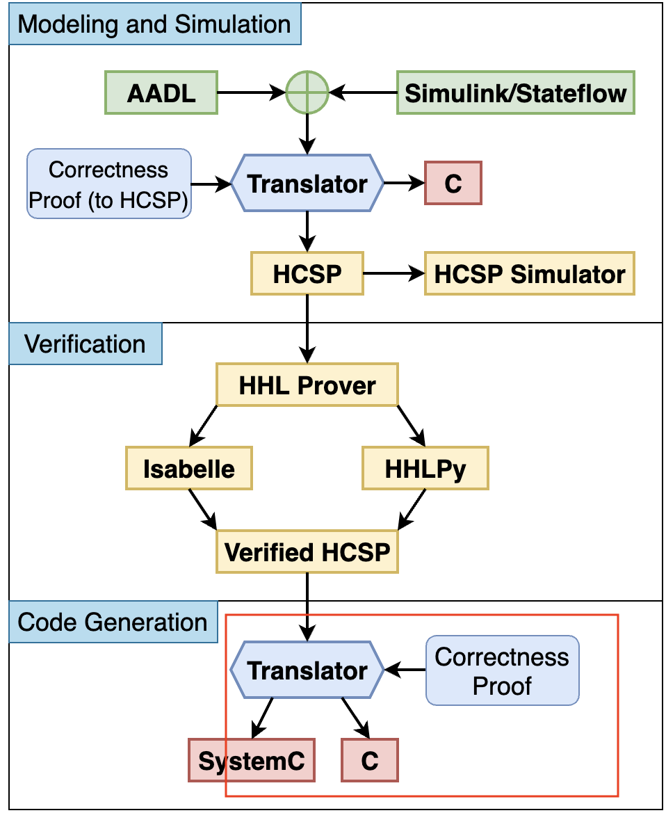

# HCSP2C


HCSP2C automatically parses the HCSP model and generates executable multi-threaded C code for it. The generated C code is guaranteed to be consistent with the original HCSP model, i.e. they satisfy the approximate bisimulation relation with given precisions allowed in discretization. 

Given any HCSP source model $pc = ||(p_i)$, $i$ in an index set $I$, an input `<model_name>.txt` file in the following format is required:

1. the definition of each sequential $p_i$, which starts with `module <module_name>(): ` and ends with `end module`.
2. the definition of the top process $pc$, i.e. the parallel composition of processes, which start with `system` and ends with `end system`.

Output files are as follows:

1. The main code of the HCSP model pc named `<model_name>.c` and the corresponding head file `<model_name>.h`;
2. The code generated from each sequential HCSP process pi named `<model_name>_<module_name>.c`;
3. A script, named `compile.sh`, for automatically compiling the code and library files generated above.


## Architecture

The tool HCSP2C is a part of our tool chain `MARS` for the modelling, analysis, verification and code generation of hybrid systems, whose architecture is shown in the following figure. HCSP2C is the translator from verified HCSP model to C.



MARS includes:

1) Graphical modeling and simulation in AADL$\oplus$Simulink/Stateflow, which is a combined model for both architectural and behavioral modelling of systems;

2) Formal modeling, simulation and verification in HCSP;

3) Automatic transformation from AADL$\oplus$S/S to HCSP, and the automatic transformation from HCSP to SystemC and C.

The input files of HCSP2C can either be written manually, when HCSP2C is used individually, or be generated automatically from the top graphical models in AADL⊕Simulink/Stateflow. The correctness proof guarantees that the generated C code satisfy the safety properties verified for HCSP formal models.

## Code Architecture of HCSP2C

HCSP2C is written in Python, which first parses the grammar of the HCSP model as input, and then generates C code for each process based on the parsed Abstract Syntax Tree (AST). The generated results need to be compiled with the library files `hcsp2c.c/.h` provided. The overall code architecture is shown below:

* `ss2hcsp`: Basic syntax parsing and utility files for HCSP
  * `hcsp`: basic syntax parser for HCSP
  * `util`: utility functions
* `hcsp2c`: Core C code generation logic and a set of functional tests
  * `transfer2c.py`: core code for generating executable C code
  * `tests/hcsp2c_test.py`: basic functional tests that cover all composite constructs of HCSP, which can be automated with the command `python3 -m unittest hcsp2c.tests.hcsp2c_test`
  * `target`: C code generated by functional tests and dependent library files `hcsp2c.c/.h`
  * `output`: executable files compiled from C code generated by functional tests. 
* `tools`: Entry files for each tool in the toolchain `MARS `. We only keep the parts related to HCSP2C.
  * `hcsp2Ccode.py`: entry file for tool `HCSP2C`
* `Examples`: Examples for applying HCSP2C
  * `input_files`: input model files
    * `LunarLander.txt`: an example of gradual mass reduction and controlled descent velocity of a lunar lander
    * `MarsLander.txt`: an example of speed control of a Mars lander
    * `AbstractFuelControl_M2.txt`: an example of vehicle fuel control
    * `systemv2.txt`: the main example discussed in the article, with $34$ modules, describes scenarios of starting acceleration and speed control after encountering an obstacle during automatic cruise control
  * `output_files`:  the folders where the generated C code files are stored, where each subfolder corresponds to an example mentioned above.

## Requirements

The Python parts for generating C codes run on Windows, MAC or Linux system. The generated C codes compile and run on Ubuntu 20.04.

1. Python 3, for running the code generation tool, available at https://www.python.org/downloads/

2. Lark 0.12 or higher;

3. Matplotlib 3.3.4 or higher. 
   The above two can be installed with pip via:
  ```bash
  python -m pip install -r requirements.txt   
  ```

4. GCC 11.2 and corresponding  dependencies, installed on Ubuntu 20.04 by apt-get:
  ```bash
  apt-get install build-essential
  ```


We also provide a Docker Image `mars_docker.tar.gz` with all dependencies and source codes, which can be installed with the following command:
  ```bash
  gunzip -c mars_docker.tar.gz | docker load
  ```

##  How to run an example in HCSP2C

To run HCSP2C on a given HCSP model, make sure that the input file `<model_name>.txt` in HCSP syntax is available, and the library files `hcsp2c.c/.h` required for compilation are in the destination folder.

Then, the following command 

```bash
python3 tools/hcsp2Ccode.py -sf Examples/input_files/systemv2.txt -dd Examples/output_files/CCS -df systemv2 -step 1e-4 -mt 40.0
```

generates C codes from HCSP model of the **automatic cruise control system** (the case study of the paper) in file `Examples/input_files/systemv2.txt`, stores the generated C codes and the script in the dictionary `Examples/output_files/CCS` with name `systemv2`. The discretization step and maximum simulation time of the model are set to $1e-4$ and $40.0$, respectively.

After that, go to the folder where the C code is stored and run the compilation script:

```bash
cd Examples/output_files/CCS 
./compile.sh
```

The compilation script generates the corresponding executable file, which is named by default to the name of the input file with the `.out` suffix. For this example, the generated executable file is named `systemv2.out`. 

When running the executable file, you may use `>` to put outputs into a `.log` file:

```bash
 ./systemv2.out > systemv2.log   
```

The result of this example is analyzed in the chapter Case Study.

This example is expected to run for $5$s.